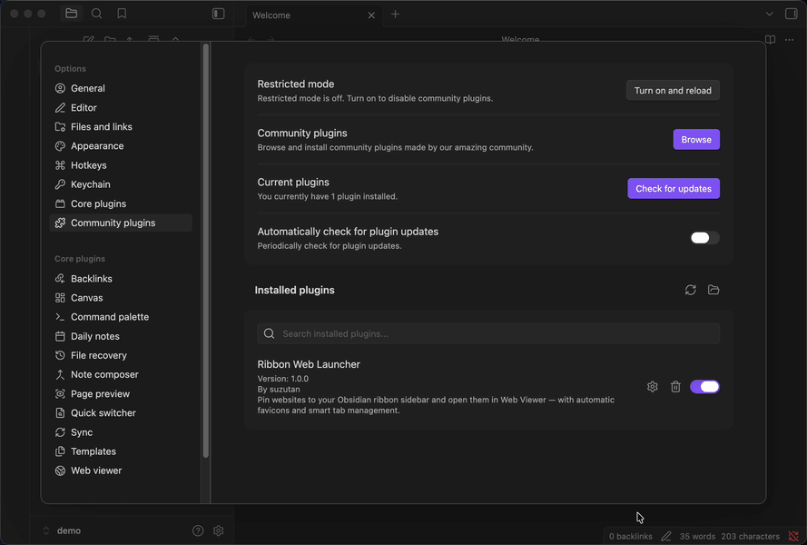

<div align="center">

# 🚀 Ribbon Web Launcher

**Obsidianのリボンに好きなWebサイトをピン留め**

[](https://opensource.org/licenses/MIT)
[](https://obsidian.md)
[](https://github.com/suzutan/obsidian-ribbon-web-launcher/releases/latest)

[English](#english) | [日本語](#japanese)

</div>

---

## <a name="english"></a>English

### What's This?

Click an icon in your Obsidian sidebar, and your favorite website opens instantly in the Web Viewer. No external browser, no tab clutter. Just one click.

**Smart tab reuse** means clicking the same icon twice won't spawn duplicate tabs—it focuses the existing one instead.

### ✨ Features

- **One-click web access**: Add Gmail, Twitter, GitHub, or any website to your ribbon
- **Automatic favicons**: Icons load from the website's domain without manual setup
- **Custom icons**: Use direct image URLs or pick from [Lucide Icons](https://lucide.dev)
- **Tab management**: Each ribbon icon reuses its own Web Viewer tab
- **Instant updates**: Icons appear the moment you save a new link

### 🎬 Demo



### 📦 Installation

#### From Community Plugins (Recommended)

1. Open **Settings** → **Community plugins** → **Browse**
2. Search for **"Ribbon Web Launcher"**
3. Click **Install** → **Enable**

#### Manual Installation

```bash
# 1. Download latest release files
# main.js, manifest.json, styles.css

# 2. Create plugin directory
mkdir -p /path/to/your/vault/.obsidian/plugins/ribbon-web-launcher

# 3. Move files into the directory

# 4. Reload Obsidian and enable in Settings → Community plugins
```

### 🚀 Quick Start

1. Go to **Settings** → **Ribbon Web Launcher**
2. Click **Add Link**
3. Fill in:
   - **Label**: Hover text (e.g., "Gmail")
   - **URL**: `https://mail.google.com`
   - **Icon type**: Choose `Favicon (auto)`
4. Save and check your ribbon. Icon appears instantly

### 🎨 Icon Options

| Type                 | When to Use                        | Example                        |
| -------------------- | ---------------------------------- | ------------------------------ |
| **Favicon (auto)**   | Most websites                      | Personal blog, GitHub          |
| **Custom image URL** | Sites with dynamic/broken favicons | Gmail, Google Calendar, Notion |
| **Lucide icon**      | Abstract concepts or no favicon    | "Random Note", "Daily Log"     |

#### Custom Icon URLs for Google Services

```
Gmail:           https://ssl.gstatic.com/ui/v1/icons/mail/rfr/gmail.ico
Google Calendar: https://calendar.google.com/googlecalendar/images/favicons_2020q4/calendar_31.ico
Google Drive:    https://ssl.gstatic.com/images/branding/product/1x/drive_2020q4_32dp.png
```

### 🔧 Requirements

- **Obsidian 1.8.0+** (Desktop only)
- **Web Viewer core plugin** must be enabled (**Settings** → **Core plugins** → **Web Viewer**)

### 🛠️ Development

```bash
# Clone the repository
git clone https://github.com/suzutan/obsidian-ribbon-web-launcher.git
cd obsidian-ribbon-web-launcher

# Install dependencies
pnpm install

# Start development mode (watch for changes)
pnpm run dev

# Build for production
pnpm run build
```

#### Project Structure

```
main.ts              # Single-file plugin (363 lines)
├── RibbonUrlLinksPlugin   # Main plugin class
├── LinkModal              # Add/Edit dialog
└── RibbonUrlLinksSettingTab  # Settings UI

manifest.json        # Plugin metadata
styles.css           # Minimal icon styling
```

### 🤝 Contributing

Pull requests welcome!

1. Fork this repository
2. Create a feature branch (`git checkout -b feature/amazing-feature`)
3. Commit your changes (`git commit -m 'Add amazing feature'`)
4. Push to the branch (`git push origin feature/amazing-feature`)
5. Open a Pull Request

Found a bug? [Open an issue](https://github.com/suzutan/obsidian-ribbon-web-launcher/issues/new).

### 📄 License

MIT License ([LICENSE](LICENSE))

---

## <a name="japanese"></a>日本語

### これは何？

Obsidianのサイドバーにあるアイコンをクリックすると、好きなWebサイトが即座にWeb Viewerで開く。外部ブラウザも、タブの散らかりもなし。ワンクリックで完結。

**スマートタブ再利用**により、同じアイコンを2回クリックしても重複タブは生成されず、既存のタブにフォーカスする。

### ✨ 機能

- **ワンクリックでWebアクセス**: Gmail、Twitter、GitHubなど、任意のWebサイトをリボンに追加
- **ファビコン自動取得**: Webサイトのドメインから自動でアイコンを読み込み
- **カスタムアイコン**: 画像URLを直接指定、または[Lucide Icons](https://lucide.dev)から選択
- **タブ管理**: 各リボンアイコンが専用のWeb Viewerタブを再利用
- **即座に反映**: 新しいリンクを保存した瞬間にアイコンが出現

### 🎬 デモ


### 📦 インストール

#### コミュニティプラグインから（推奨）

1. **設定** → **コミュニティプラグイン** → **閲覧**を開く
2. **"Ribbon Web Launcher"**を検索
3. **インストール** → **有効化**をクリック

#### 手動インストール

```bash
# 1. 最新リリースファイルをダウンロード
# main.js, manifest.json, styles.css

# 2. プラグインディレクトリを作成
mkdir -p /path/to/your/vault/.obsidian/plugins/ribbon-web-launcher

# 3. ファイルをディレクトリに配置

# 4. Obsidianをリロードし、設定 → コミュニティプラグインで有効化
```

### 🚀 クイックスタート

1. **設定** → **Ribbon Web Launcher**を開く
2. **Add Link**をクリック
3. 入力項目：
   - **Label**: ホバー時のテキスト（例: "Gmail"）
   - **URL**: `https://mail.google.com`
   - **Icon type**: `Favicon (auto)`を選択
4. 保存してリボンを確認。アイコンが即座に表示される

### 🎨 アイコンオプション

| タイプ               | 使い分け                           | 例                               |
| -------------------- | ---------------------------------- | -------------------------------- |
| **Favicon (auto)**   | ほとんどのWebサイト                | 個人ブログ、GitHub               |
| **Custom image URL** | ファビコンが動的/壊れているサイト  | Gmail、Googleカレンダー、Notion  |
| **Lucide icon**      | 抽象的な概念やファビコンがない場合 | "ランダムノート"、"デイリーログ" |

#### Googleサービス用カスタムアイコンURL

```
Gmail:           https://ssl.gstatic.com/ui/v1/icons/mail/rfr/gmail.ico
Googleカレンダー: https://calendar.google.com/googlecalendar/images/favicons_2020q4/calendar_31.ico
Google Drive:    https://ssl.gstatic.com/images/branding/product/1x/drive_2020q4_32dp.png
```

### 🔧 要件

- **Obsidian 1.8.0以上**（デスクトップのみ）
- **Web Viewerコアプラグイン**が有効である必要がある（**設定** → **コアプラグイン** → **Web Viewer**）

### 🛠️ 開発

```bash
# リポジトリをクローン
git clone https://github.com/suzutan/obsidian-ribbon-web-launcher.git
cd obsidian-ribbon-web-launcher

# 依存関係をインストール
pnpm install

# 開発モード開始（変更を監視）
pnpm run dev

# プロダクションビルド
pnpm run build
```

#### プロジェクト構造

```
main.ts              # シングルファイルプラグイン（363行）
├── RibbonUrlLinksPlugin   # メインプラグインクラス
├── LinkModal              # 追加/編集ダイアログ
└── RibbonUrlLinksSettingTab  # 設定UI

manifest.json        # プラグインメタデータ
styles.css           # 最小限のアイコンスタイリング
```

### 🤝 コントリビューション

プルリクエスト歓迎！

1. このリポジトリをフォーク
2. フィーチャーブランチを作成（`git checkout -b feature/amazing-feature`）
3. 変更をコミット（`git commit -m 'Add amazing feature'`）
4. ブランチにプッシュ（`git push origin feature/amazing-feature`）
5. プルリクエストを開く

バグを見つけた？[Issueを作成](https://github.com/suzutan/obsidian-ribbon-web-launcher/issues/new)してください。

### 📄 ライセンス

MITライセンス（[LICENSE](LICENSE)）

---

<div align="center">

Made with ❤️ by [suzutan](https://github.com/suzutan)

⭐ Star this repo if you find it useful!

</div>
